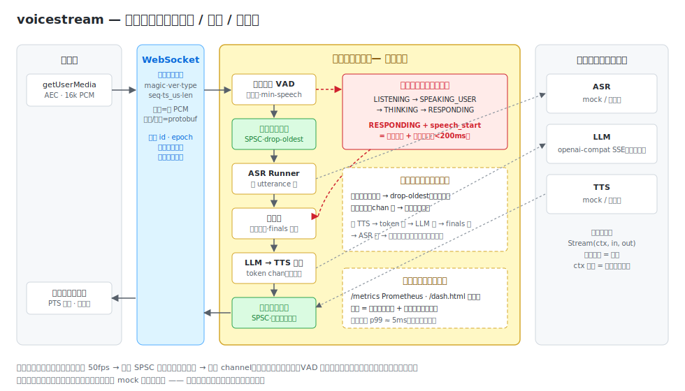
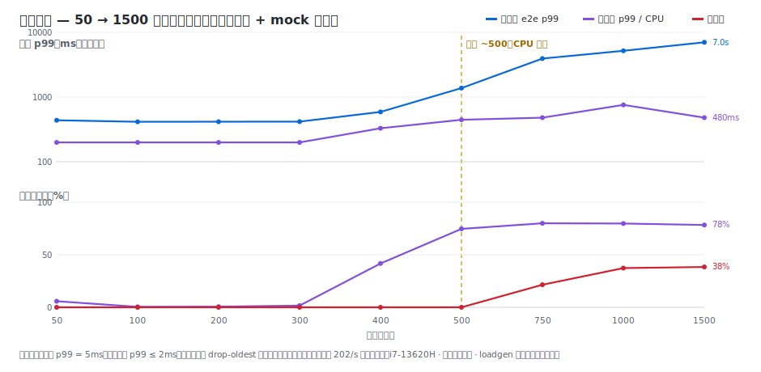
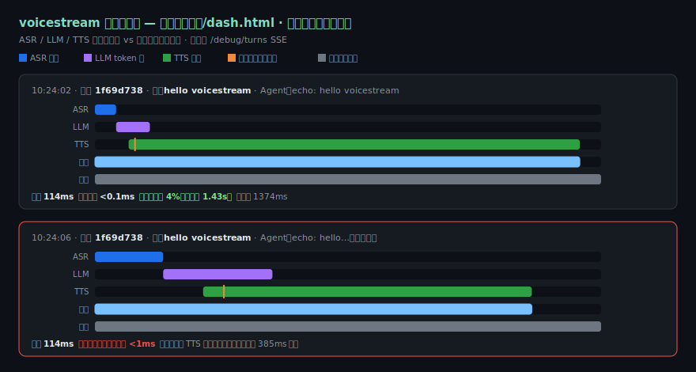
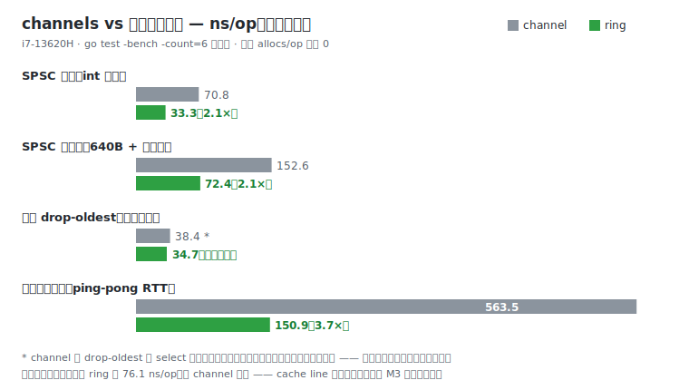

# voicestream

实时多模态语音 Agent 的**流式内核**（Go）。它是夹在麦克风/扬声器与 AI 模型之间的
模型无关中间层，只负责三件事：**时序 / 背压 / 打断**。ASR、LLM、TTS 是可插拔的
租户，不是内核的一部分。

> 北极星：浏览器里能对话、能在 Agent 应答中**自然打断**，且这条会话运行在被压到
> 容量拐点的真实负载之中——交付物是一条带拐点与优雅降级证明的负载/延迟曲线。



## 它证明了什么

| 指标 | 实测 | 出处 |
|---|---|---|
| 打断（内核取消）p99 | **&lt;2ms** 平台区 · **≤143ms** @ 3×拐点负载（预算 200ms） | M10 容量曲线 |
| 内核开销 p99（首响减模型固有时延） | **5ms** 平台区恒定 | M9/M10 分解口径 |
| 容量拐点 | ~500 并发会话（i7-13620H · 功率受限 · loadgen 同机，**下界**） | M10 |
| 过墙行为 | 入口 drop-oldest 卸载 21→38%、出口零丢帧、无崩溃无 OOM；5000 会话过载后回落 0 会话/7 goroutines | M10 |
| 音频热路径分配 | 环 SPSC 0 allocs/op · 下行编码 0 allocs/op（测试门禁） | M3/M11 |

### 容量曲线（L2）



平台区一切平直；拐点处 CPU 墙先到；过墙后**双背压按设计在入口卸载**——压力沿
TTS→token→finals→ASR 链传回，表现为入口丢帧（计数）而非内存增长或崩溃。
交互式版本：`docs/load/capacity.html`；复现：`go run ./cmd/loadgen -h`。

### 延迟瀑布图（L1）



LLM 与 TTS 时间条天然大面积重叠——这就是流水线；灰色串行条是同样三段跨度
首尾相接的长度。被打断的轮红框标注内核取消耗时。实时版本跑在
`http://localhost:8080/dash.html`（SSE 逐轮推送）。

### channels vs 无锁环形缓冲（L3）



环不是为了打榜：drop-oldest 速度几乎持平，真正的差异是**驱逐语义的原子性**
（channel 的 select 模拟在并发下不成立）。另一个诚实发现：去掉伪共享填充的环
比 channel 还慢——无锁结构做错了不如不做。

### 打断演示（L0 北极星）

<!-- TODO(7.6): docs/assets/barge-in.gif —— 真实麦克风录制：
     go run ./cmd/server → Chrome http://localhost:8080/ →
     说一句话 → 应答中再次开口 → 状态条显示打断、播放即停。
     推荐 ScreenToGif 录制浏览器窗口。 -->
*待真实麦克风录制（任务 7.6）——代码与服务端 e2e 已就绪，见 `web/`。*

## 快速开始

```bash
go run ./cmd/server          # 默认全 mock，浏览器打开 http://localhost:8080/
go test -race ./...          # 全量测试
go run ./cmd/loadgen \
  -steps 50,100,200,400,800 -out docs/load   # 复现容量曲线
```

接真实 LLM（任何 OpenAI 兼容端点，密钥只走环境变量）：

```bash
export VOICESTREAM_LLM_API_KEY=sk-...
# config.yaml: adapters.llm: openai-compat（base_url/model 见 internal/config）
VOICESTREAM_CONFIG=config.yaml go run ./cmd/server
```

## 设计要点（详见 docs/）

- **双背压按数据语义分流**：音频两端高频（50fps/路）走无锁 SPSC 环 + drop-oldest
  （实时音频丢旧帧是 feature）；文本中段低频走有界 channel 阻塞回传（文本不可丢）。
  两者在入口汇合：慢模型 → 链式阻塞 → 表现为入口计数丢帧，内存有界为构造性质。
- **打断是控制面**：内联能量 VAD（入口读 goroutine 内，保持严格 SPSC）驱动四态
  状态机；`RESPONDING + speech_start` → 子链 ctx 取消 + 在途清空。取消路径不经过
  拥塞队列，所以 200ms 预算在过载下依然成立。
- **会话与连接解耦**：单调 epoch 防陈旧帧污染、seq 水位去重（TCP 有序使重排窗口
  不必要——诚实地不做）、断线重连续传、idle 回收兜底。
- **可观测性是背景板**：手写 Prometheus 文本格式（~150 行零依赖）、SSE 瀑布仪表盘；
  首响 = 模型固有时延 + 内核开销，分开计量，绝不给内核贴模型的金。

| 文档 | 内容 |
|---|---|
| `docs/M2-transport-design*.md` | 帧协议与 WS 传输 |
| `docs/M3-ringbuf-design*.md` | Vyukov 槽序列 SPSC 环、drop-oldest 无竞争驱逐 |
| `docs/M5-pipeline-design*.md` | 编排与双背压、延迟分解 |
| `docs/M6-vad-bargein-design*.md` | 内联 VAD 与打断状态机 |
| `docs/M8-session-design.md` | 会话生命周期、epoch、重放去重 |
| `docs/M9-metrics-design.md` | 指标与瀑布仪表盘 |
| `docs/M10-loadgen-design.md` | 负载 harness、容量曲线、撞墙归因 |

完整提案/设计/规格/任务：`openspec/changes/streaming-multimodal-agent-engine/`。

## 范围（v1）

WebSocket + PCM 16k/16-bit/mono；模型云优先（LLM 已接真实 SSE 流）。
FFmpeg 编解码、gRPC/WebTransport 传输拆为未来独立 change。
